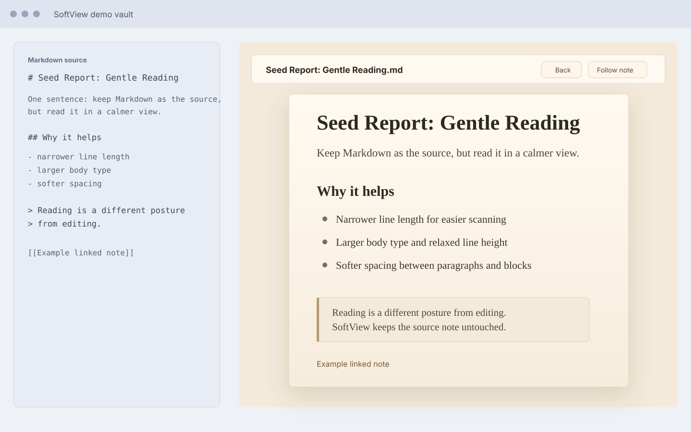

# SoftView

SoftView opens the current Markdown note in a warm, focused reading view inside Obsidian.

It does not generate external HTML, does not open a system browser, and does not modify your Markdown files. Your note remains the single source of truth; SoftView is only a softer way to read it.



## Why SoftView

Obsidian is excellent for writing, linking, and editing. Reading often wants a different posture: narrower lines, warmer background, gentler spacing, and less interface noise.

SoftView keeps you inside Obsidian while giving the active note a paper-like reading surface.

## Features

- Open the current Markdown note in a custom SoftView pane.
- Render Markdown through Obsidian's `MarkdownRenderer`.
- Preserve Obsidian-style internal links, images, callouts, tags, and embeds as closely as possible.
- Use a warm reading layout with comfortable width, line height, spacing, quotes, callouts, and code blocks.
- Open from the ribbon book icon.
- Open from the command `Open current note`.
- Refresh with the icon button in the toolbar.
- Toggle `Follow current note` to update SoftView when you switch Markdown files.
- Click internal links inside SoftView and navigate within the reading pane.
- Use `Back` to return to the previous SoftView article and restore the prior scroll position.

## Installation

Once SoftView is available in the Obsidian community plugin browser:

1. Open Obsidian Settings.
2. Go to Community plugins.
3. Search for `SoftView`.
4. Install and enable the plugin.

## Manual Installation

Download the latest release files:

- `main.js`
- `manifest.json`
- `styles.css`

Place them in:

```text
<your-vault>/.obsidian/plugins/softview/
```

Then restart Obsidian or reload community plugins, and enable `SoftView`.

## Usage

1. Open any Markdown note in Obsidian.
2. Click the ribbon book icon, or run `Open current note` from the command palette.
3. Read in the SoftView pane.
4. Use the refresh icon after editing the source note.
5. Turn on `Follow current note` if you want SoftView to update when you switch notes.
6. Click internal links to move through your notes inside SoftView, then use `Back` to return.

## Release Requirements

For every release:

1. Update `manifest.json` to a semantic version in `x.y.z` format.
2. Update `versions.json`.
3. Build the plugin.
4. Create a GitHub release whose tag matches the version in `manifest.json`.
5. Upload `main.js`, `manifest.json`, and `styles.css` as release assets.

## Development

```bash
npm install
npm run build
```

On Windows PowerShell, if `npm.ps1` is blocked:

```bash
npm.cmd install
npm.cmd run build
```

## Privacy

SoftView runs locally inside Obsidian. It does not upload your notes or send note content to any external service.

## License

MIT
